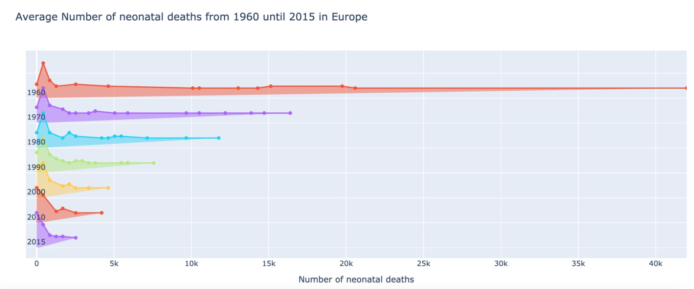
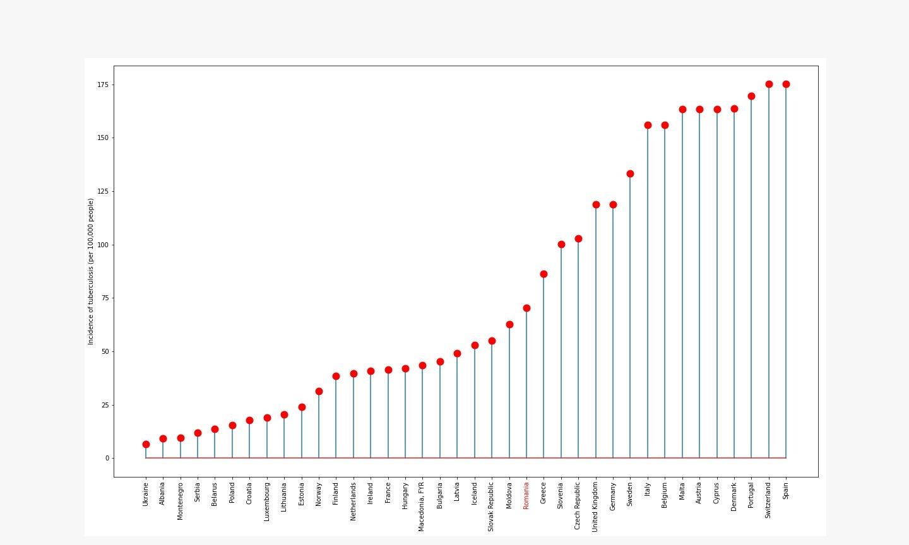

# Motivation

<div align="justify">

The Covid-19 pandemic has shifted so much attention towards treating the virus that crucial areas of Romanian healthcare have been all but forgotten. Our society presents rampant cronic problems, such as:

1. Child and maternal mortality rates due to poor infrastructure;
2. HIV infestation rates due to the underinvestment into long-time HIV treatment;
3. Teenage pregnancies and the ignorance towards contraception methods due to the lack of sexual health education.

Although the existence of issues such as those listed above is an acknowedged sad reality in Romania multiple succeding Governments have done little to nothing to control and reduce them. Most of the poilticians' initiatives focus on cutting investments, spendings and salaries from the health and education sectors rather than the allocation of more funds and manpower in order to solve the problems of the people they serve and represent.

We took this opportunity to conduct a visual-focused analysis on the situation of the Romanian heathcare system and its pitfalls, while also drawing a parallel with other E.U. and Schengen countries. We decided to compare our country namely with its Western counterparts, as those are the ones to realize the importance of investing heavily into public healthcare, health education and research. We avoided the United States as it an underdeveloped country when it comes to the healthcare sector.

The presentation contains intuitive visualizations, along with the necesary explanations, conclusions and connections we have made with diferent parts of our data. It also provides a machine learning modelling section in which we showcase how to predict a country's <a href="http://hdr.undp.org/en/content/human-development-index-hdi">Human Development Index</a> and how to visually analyze the results. Due to our lack of experience with Rmarkdown, some of the plots have ended up being smaller than expected when embedded in the HTML file. We would like to apologize for the inconvenience and ask the reader to zoom in the browser to check those plots which seem too small.

This project has been developed for the Data Visualization course at the  <a href="https://fmi.unibuc.ro/">Faculty of Mathematics and Computer Science</a>, University of Bucharest. 

</div>
 
# Data

<div align="justify">

The dataset we have employed for this project is the <a href="https://databank.worldbank.org/source/world-development-indicators">World Development Indicators</a> published by World Bank and forwarded as a CSV file through <a href="https://www.kaggle.com/">kaggle</a>. The data set contains 1346 social and economic indicators for 247 countries and geopolitical groups, collected over 55 years, from 1960 to 2015. Thus, it presents a total of 13585 samples.

We have manually processed our data and extracted 79 economic, educational, social and health indicators the we have used within our graphs, along with the country to which they belong to and the year in which they have been recorded.  Out of all the preemptively extracted features, we have only used a handful of insighful ones, part of which are presented in the table below:

{width=100%}

Bear in mind that the data contains NaN values, so we used imputation methods such as kNN and <a href="https://cran.r-project.org/web/packages/softImpute/index.html">SoftImpute</a> to infer the missing data points. The first gave an unnormalized output which we used during plotting, whilst the latter gave normalized data, used in the prediction process. Because of the imputation methods, some samples have been skewed. We have taken this into account when visualizing the data and shall notify the reader when required.

</div>

## Preprocessing

<div align="justify">

The initial dataset is suitable for neither visualization, nor modelling, given that it contains one indicator, per year, per country, along with unnecessary information for us, such as *CountryCode* and *IndicatorCode*. The raw data format can be seen in the figure below:


The first step that we took was to restructure our data.  We have dropped the *CountryCode* and *IndicatorCode* columns and added a column for every feature. Next, we have discarded the Value column and placed the sample in its respective column. This way each sample will contain all indicators observed in a year, per every year, per every country. In other words, we have converted the data to the standard format used in the machine learning community.

This was followed by the missing sample imputation step, which is of technical nature, so we will let the curious individuals check that in our <a href="https://github.com/mateibejan14/cafelutsa-infovis-project-2021">GitHub repository</a> if they so desire.

</div>

# Analysis

## Ridge plots presenting the distribution of a several features over years

{width=100%}

{width=100%}

{width=100%}

{width=100%}

{width=100%}

{width=100%}

# Correlation

## Scatter plots displaying the relationship between 2 features

{width=100%}

## 3D barplots highlighting the correlation of 2 features over several years, for several countries

{width=100%}

{width=100%}

{width=100%}

{width=100%}

## Bubble plots highlighting the relation between 2 features, also presenting the importance of the correlation through the size of the circle

{width=100%}

{width=100%}

{width=100%}

{width=100%}

{width=100%}

{width=100%}

{width=100%}

{width=100%}

# Comparison

## Geographical heatmap plots emphasizing the distribution of a feature in a year via the intensity of the colouring, offering a visual comparison between multiple countries

### Healthcare and mortality

<div name="geo1">
{width=100%}
</div>

### Health expenditure and the possible relationship between mortality and tuberculosis

{width=100%}

### Education investment and sexual health and disease

{width=100%}

## Time series bar plots showcasing the evolution of HIV prevalence while also providing a comparison with other countries

{width=100%}

{width=100%}


## Circular bar plots providing an intuitive parallel between the condom usage in European countries

<center>
{width=75%} 

{width=75%}

</center>

## Lollipop plots displaying a feature for several countries, ordered by value

{width=100%}

{width=100%}

{width=100%}

{width=100%}

{width=100%}

{width=100%}

{width=100%}

## Time series violin plots providing an intuitive insight towards the feature distribution of several countries

{width=100%}

{width=100%}

{width=100%}

{width=100%}

# Modelling

<div align="justify">

We have taken a two-fold approach in our modelling endeavour, by predicting both the GDP per capita and a new composed HDI feature, computed as shown below:

{width=100%}

Predicting the GDP was backed up by the fact that it is naturally connected with the wellbeing of the population, by  law of casual inference. Our second approach, using the HDI, was of a calculated consistent nature, edorsed by correlations drawn by experts over long periods of time. We have excluded the compound feature that were used to model the HDI feature, namely *GNI (current US$)*, *Life expectancy at birth, total (years)* and *Expenditure on education as % of total government expenditure (%)*. If we haven't, then the random forest would obviously use these feature to model the HDI.

We used the random forest model in both cases. The pipelines consisted feature selection using random forest, a K-Fold randomized grid search and finally the prediction itself using the random forest model. We employed the data imputed with the SoftImpute method, as the method normalizes the samples during the process.

The code itself is rather standard for this type of task, so we left it out of the current presentation. However, we did include the optimized hyperparameters for those curious, as well as the top features selected by the model.

</div>

## GDP per capita Prediction

<div align="justify">

As it can be seen in the histogram below, the model presents high concentration of 0-value residuals, however with considerably heavy tails. Moreover, although there is a concentration of residuals around the (0, 0) point, the scatter plot indicates our predictor has a peculiar behaviour, highlighted by the distribution of the residuals towards the right-hand side of the plot. The QQ-Normal plot has a flat area in the middle, indicating the presence of similar values.


{width=32%} {width=32%} {width=32%}

The readers can find the top 5 most important predictors and the hyperparameters below. The predictors are mostly economic, regading expenditures and savings. It is interesting that the model used the neonatal mortality rate instead of another factor such as the GNI.

```
Important coefficients chosen by the random forest model: 
{Health Expenditure per capita (current US$), 
Mortality rate, neonatal (per 1,000 live births), 
Oil rents (% of GDP), Exports of goods and services (current US$), 
Adjusted savings: education expenditure (current US$)}

Best hyperparameters:
{'n_estimators': 1500, 'min_samples_split': 2, 'min_samples_leaf': 47, 
'max_features': 17, 'max_depth': 220, 'bootstrap': True}
```


</div>

## HDI Prediction

<div align="justify">

The HDI predictor has a high 0-value residuals count, just like its GDP counterpart. A slight difference would be in the heavier tails. The scatter plot on the other hand expresses a more consistent behaviour, the values being distributed relatively symmetrically on the X=0 axis and centered around the (0, 0) point. The heavy-tailed QQ-Normal plot denotes the preponderance of extreme values.

<center>
{width=39%} {width=35%}
</center>

The readers can find the top 5 most important predictors and the hyperparameters below. In the case of the HDI, the model seems to have correlated a numer of mortality features with the *Life expectancy at birth, total (years)* feature we have used to compute the HDI, as well as the education expenditure. One may have expected to see the GDP in there, as it is calculated using the GNI, spendings and savings.


```
Important coefficients chosen by the random forest model: 
{Mortality rate, adult, female (per 1,000 female adults), 
Mortality rate, under-5, female (per 1,000 live births),
Mortality rate ratio (modeled estimate, per 100,000 live births),
Adjusted savings: education expenditure (current US$),
Mortality rate, infant (per 1,000 live births)}


Best hyperparameters:
{'n_estimators': 1500, 'min_samples_split': 2, 'min_samples_leaf': 47, 
'max_features': 17, 'max_depth': 220, 'bootstrap': True}
```
</div>

# Conclusions

Our analysis has highlighted the evident gap between the Romanian healthcare system and its West-European peers (e.g. Netherlands, Denmark, United Kingdom, Norway). 

The exposed Romanian healthcare problems are deeply rooted in the lack of investment and funding in both the health and education sectors. The consequences reverberate throughout society, be it the skyrocketing child mortality rates due to the lack of specialized wards, or the prevalence of STDs and teenage pregnancies due to non-existent sexual health education.

Thank God for Bulgaria!

# Further Work

Since this was a course project, the time we managed to attribute it was rather limited. A more clean visualization would be enabled through a more attentive feature selection step, as some of our preemptively selected features were obsolete, as well as a imputation processed tailored for these types of features, perhaps using a strongly regularized regression or a crafty SVM kernel.